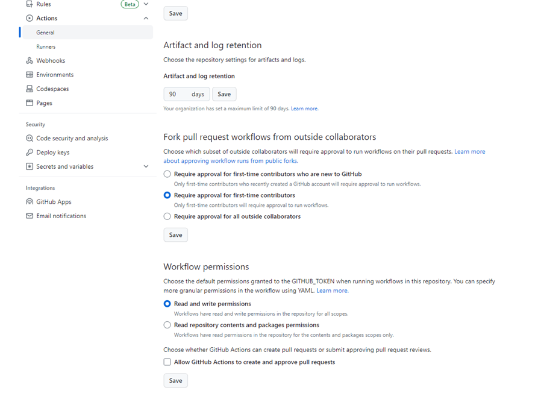

# PR_VERSIONING
A github action to to automatically create tags linked to Pull Requests based upon the pull request title

## Example:
The action can be run as follows: 

```yaml
name: Versioning

on:
    pull_request:
      types:
        - closed
  
jobs:
    create_tag_on_approved_pr:
        if: github.event.pull_request.merged == true
        runs-on: ubuntu-latest
        steps:
          - name: Print PR title
            run: echo "#${{ github.event.number }} ${{ github.event.pull_request.title }} has been merged"
            
          - name: Clone Repository
            uses: actions/checkout@v3
            with:
                ref: main
                fetch-depth: '0'
          - name: Creating a tag
            uses: developerdenesh/pr_versioning@main
            with:
                workspace: ${{ github.workspace }}
                title: ${{ github.event.pull_request.title }}
```

## Common Errors
1. If the following error is seen - fatal: unable to access 'https://github.com/someuser/somerepo': The requested URL returned error: 403. Make sure the settings to allow actions to make changes to a repository is set appropriately as seen here: 

## Resources: 
The concept has arisen from [Conventional Commits](https://www.conventionalcommits.org/en/v1.0.0/). This will work best when used together with [semantic-pull-request](https://github.com/amannn/action-semantic-pull-request/tree/v5/)
